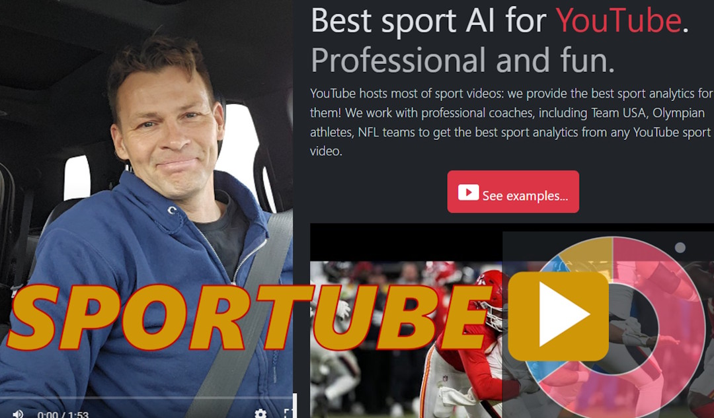

MyAIStartups.com is a venture capital founded by real AI data scientists and engineers - we are not just investors - we ultimately know AI. Our investment strategy is based on AI Blueprint, the platform that lowers the risks, entry barriers and costs of launching your AI projects from scratch.

## My AI Startups - Portfolio

Our AI startup portfolio includes a diversified set of startups built with our AI Blueprint framework, which lowers investment costs and entry barriers for new technology. Here's some of the showcases:

- [Sportube](https://sportubeai.com) - Sport analytics AI for YouTube and videos
- [Agentomat](https://agentomat.com) - Business AI Agents as a Service (AaaS) 
- [AI Coaching](https://aicoaching.us) - AI Coaching is a platform for coaching with AI by US Olympic and Paralympic Committee and more than 30+ professional sport teams
- [Livebook](https://livebookai.com) - AI E-commerce - first in the world publicly available AI Agent, running since 2022.

Check My AI Startups video blogs for latest updates!

## My AI Startups - Venture Capital

How we invest - [Watch on YouTube](https://youtu.be/YbPU1ZQO82k)

Stay tuned for the new show in town! My name is Kevin Ashley, in this video blog I'll share live stories of building AI startups from the ground up. For 11 years I worked at Microsoft, then on AI team at Google. I'll share my uncensored and unapologetic experience of building AI startups as it happens. In fact some of my new startups we'll start together as this podcast unfolds.

## Sportube - Turn any video into AI agents

Sportube AI - [Watch on YouTube](https://youtu.be/3keuGaGksC4)

### Sportube AI analytics for YouTube sport videos

Sportube AI provides professional insights for any YouTube sport videos. It's like having a professional AI coach that can answer your questions about YouTube sport videos, shorts, matches, sport events and competitions. 

#### More about Sportube

* [Sportube - Sport analytics for YouTube 2](https://youtu.be/vUVNPBxdrdE)
* [Sportube - Sport analytics for YouTube 1](https://youtu.be/fJZriI9kFlI)
* [Sportube - Intro 2](https://youtu.be/xu1al7CEg_k)
* [Sportube - Intro 1](https://youtu.be/JRkqy7U6qkc)

### My AI Startups Highlights - AI Coaching

AI Coaching is our joint project with the US Olympic and Paralympic Committee that provides AI Assistants available 24/7 for coaches and athletes to help with everyday training, coaching practice, personal training and more. 

[aicoaching.us](https://aicoaching.us)

**Customers**: US Olympic and Paralympic Committee, National Governing Bodies: US Figure Skating, US Wrestling, USA Surfing, US Biathlon, US Gymnastics.

## My AI Startups Highlights - AI Agents for Business - AGENTOMAT AaaS

New AI platform to accelerate your AI solutions. If you are thinking of starting an AI solution for your business, consider our blueprint solutions! A blueprint is a prebuilt solution that can be customized by our consulting team or in partnership with your business to the needs of your business. 

[agentomat.com](https://agentomat.com)

[Agents as a Service for Business (AaaS)](https://agentomat.com)

### My AI Startups Highlights - Livebook AI - E-Commerce

Livebook AI is the first publicly available AI Agent, that has been running continuously since 2022. It was the first agent with AI Kiosk, installed at the Computer History Museum in Mountain View, California, entertaining visitors since 2022. It creates stories and illustrations in multiple categories.

[livebookai.com](https://livebookai.com)

### My AI Startups Highlights 1+AI - Our Business Model

1+AI is a new buisiness model we offer to our customers, based on AI Blueprint platform we developed. Let us build your solution, using our 1+AI development model that consists of a single human engineer + AI. We deliver end-to-end AI solutions for businesses requiring deep AI expertise, AI Agents, Web and mobile applications using AI, AI Search, support and other custom solutions, on any cloud platform.

## Stay tuned, SOON on YouTube and Linkedin
