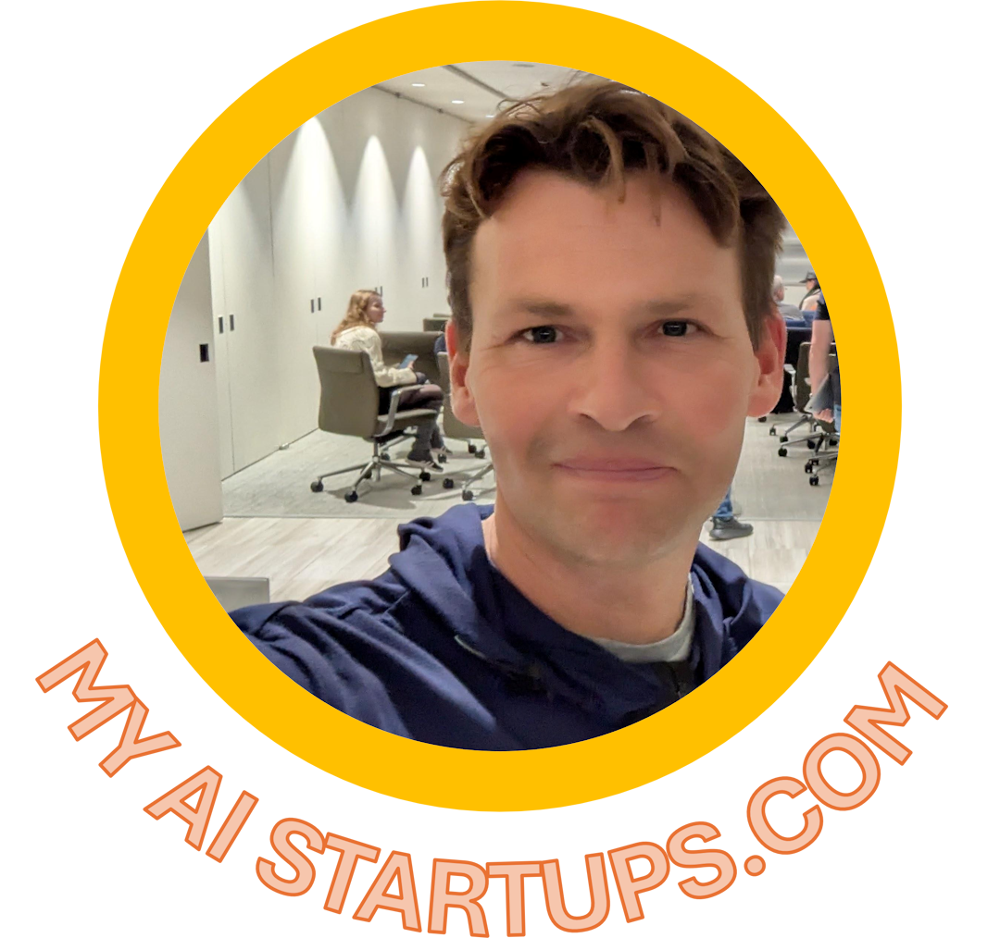
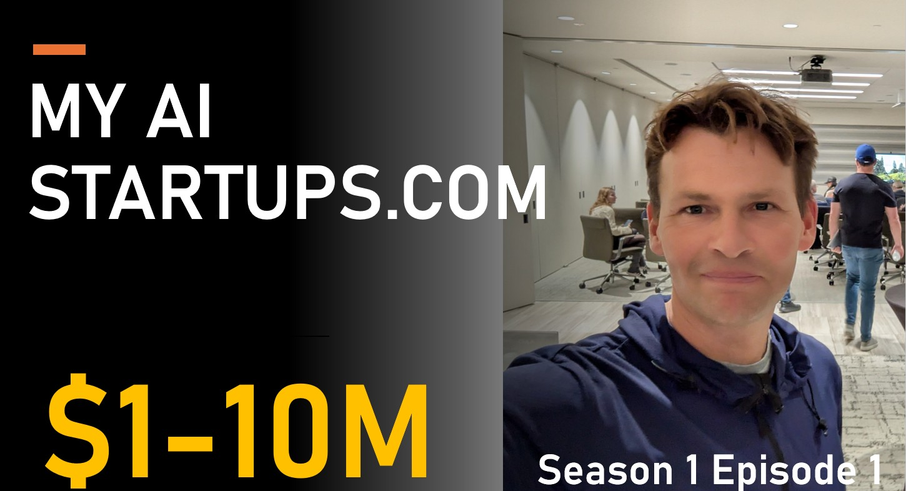
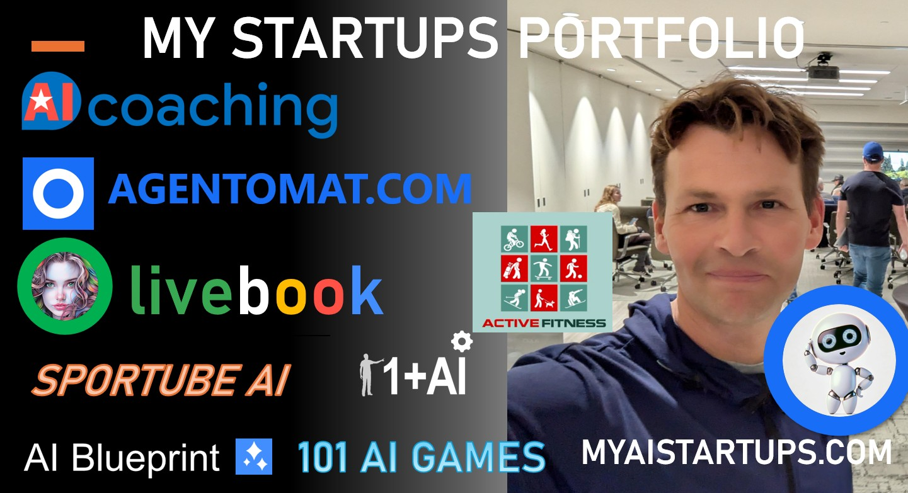
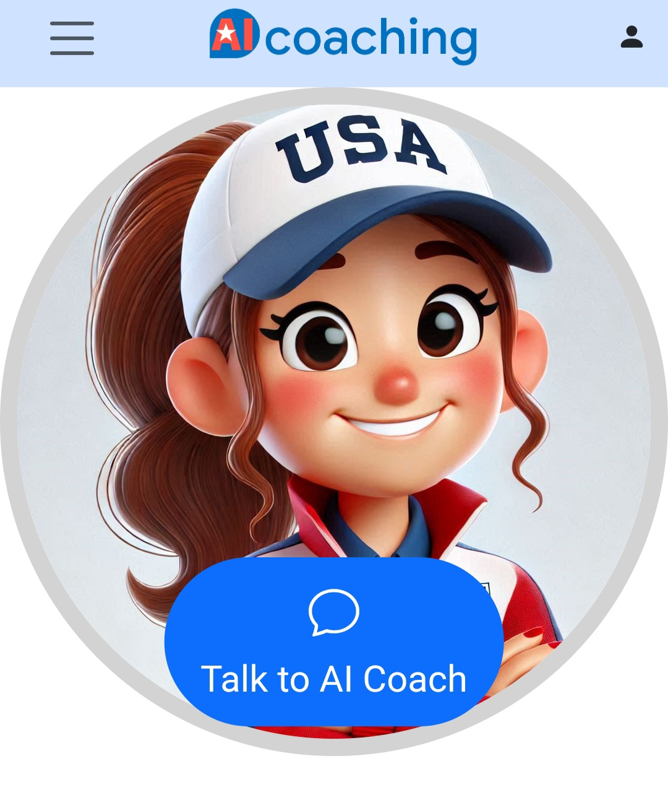
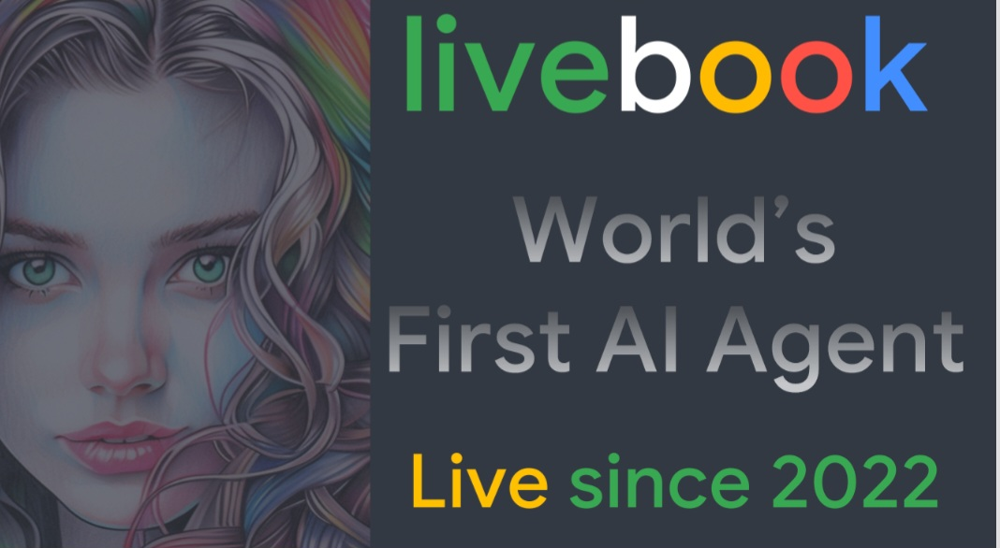
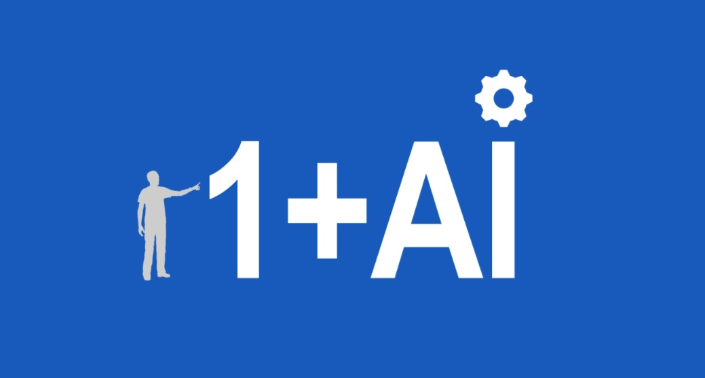

My AI Startups VC is founded by AI engineers and data-scientists. We are a Venture Capital and AI franchise that helps businesses launching AI projects. Lower the risks and costs of your AI projects with our unique AI Blueprint platform and get funded.

## My AI Startups - Season 1 

Episode 1 - [Watch on YouTube](https://youtu.be/YbPU1ZQO82k)

### In the first episode - startups portfolio

Stay tuned for the new show in town! My name is Kevin Ashley, in this video blog I'll share live stories of building AI startups from the ground up. For 11 years I worked at Microsoft, then on AI team at Google. I'll share my uncensored and unapologetic experience of building AI startups as it happens. In fact some of my new startups we'll start together as this podcast unfolds.

### Season 1 Episode 2 - AI Coaching

AI Coaching is our joint project with the US Olympic and Paralympic Committee that provides AI Assistants available 24/7 for coaches and athletes to help with everyday training, coaching practice, personal training and more. 

[aicoaching.us](https://aicoaching.us)

**Customers**: US Olympic and Paralympic Committee, National Governing Bodies: US Figure Skating, US Wrestling, USA Surfing, US Biathlon, US Gymnastics.

**VALUATION**

2025 Valuation. Here's how it breaks down:
- **Revenue Two Years Ago**: $60,000
- **Revenue Last Year**: $200,000
- **Revenue This Year**: $300,000

Assuming a conservative revenue multiple of 5x (which is quite typical for many startups), your startup’s valuation could be approximated as:

- Two Years Ago: $60,000 * 5 = $300,000
- Last Year: $200,000 * 5 = $1,000,000
- This Year: $300,000 * 5 = $1,500,000

### Season 1 Episode 2 - AGENTOMAT

New AI platform to accelerate your AI solutions. If you are thinking of starting an AI solution for your business, consider our blueprint solutions! A blueprint is a prebuilt solution that can be customized by our consulting team or in partnership with your business to the needs of your business. 

[agentomat.com](https://agentomat.com)

[Agents as a Service for Business (AaaS)](https://agentomat.com)

### Season 1 Episode 3 - Livebook

Livebook AI is the first publicly available AI Agent, that has been running continuously since 2022. It was the first agent with AI Kiosk, installed at the Computer History Museum in Mountain View, California, entertaining visitors since 2022. It creates stories and illustrations in multiple categories.

[livebookai.com](https://livebookai.com)

### Season 1 Episode 4 - 1+AI

1+AI is a new buisiness model we offer to our customers, based on AI Blueprint platform we developed. Let us build your solution, using our 1+AI development model that consists of a single human engineer + AI. We deliver end-to-end AI solutions for businesses requiring deep AI expertise, AI Agents, Web and mobile applications using AI, AI Search, support and other custom solutions, on any cloud platform.

#### 1+AI Showcase

These projects were created by a single human + AI, based on AI Blueprint framework which includes a mobile Web app, customized flexible AI models, agents, security and more:

- [AGENTOMAT](https://agentomat.com) - AI Agents as a Service (AaaS) - the easiest platform for AI agents
- [AI Coaching](https://aicoaching.us) - AI Coaching is a platform for coaching with AI by US Olympic and Paralympic Committee 
- [Livebook](https://livebookai.com) - First in the world publicly available AI Agent, running since 2022.

## Stay tuned, SOON on YouTube and Linkedin
